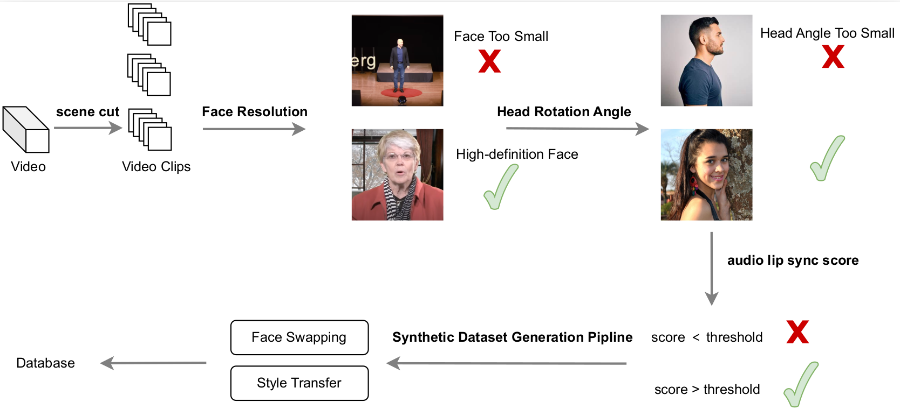

## Dataset

### 1.0 Data Packing

We package the MP4 video data into tar archives, with each tar file limited to approximately 512MB in size. This sizing is optimized for our cloud server environment, as it allows for faster data read operations at this file size. You can adjust the packaging according to your specific requirements.

### 2.0 Data Filtering by Pose

We utilize DWPose for all facial detection tasks. However, substituting it with Xpose generally yields superior results, particularly for non-facial data.

A video segment is classified as containing invalid frames based on the following criteria:

- Frames that include multiple faces or where the face, after being expanded outward, has a pixel size smaller than a defined threshold.
- Each frame within every video segment is flagged to indicate whether it is valid or not.

If a video segment contains more than 90% invalid frames relative to the total number of frames, that segment is filtered out.

After this phase of data cleaning, the resulting dataset is suitable for image-driven training but is not appropriate for audio-driven training.

### 3.0 Data Filtering by Audio

During the mixed-modality training phase involving both audio and visual data, we define invalid frames in a video segment as follows:

- Frames where the synchronization confidence score (conf) calculated by SyncNet between the audio and lip movements falls below a specified threshold.
- Frames where the face is oriented too far to the left or right relative to the camera.
- Frames where there is excessive movement of the face.

Note: After this cleaning phase, valid frames are no longer marked. If a video segment contains more than 90% invalid frames relative to the total number of frames, that segment is removed from the dataset.

The resulting dataset after this cleaning process is suitable for audio-driven training. For the V2 dataset, the cleaning is based on the results from the V1 cleaning process.