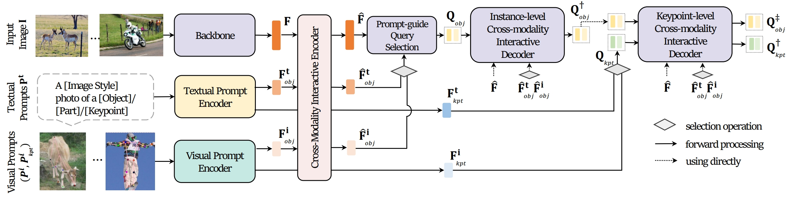
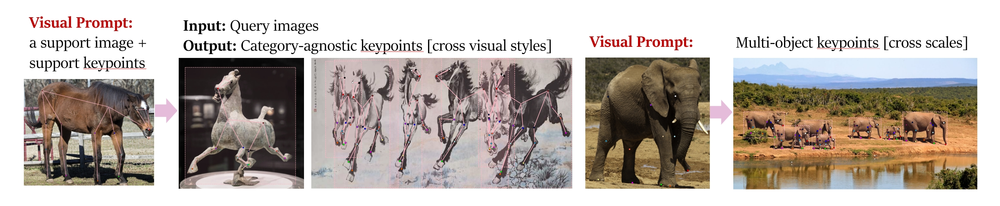
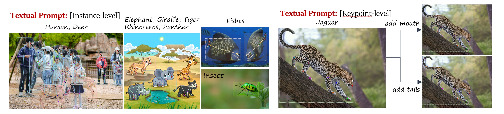
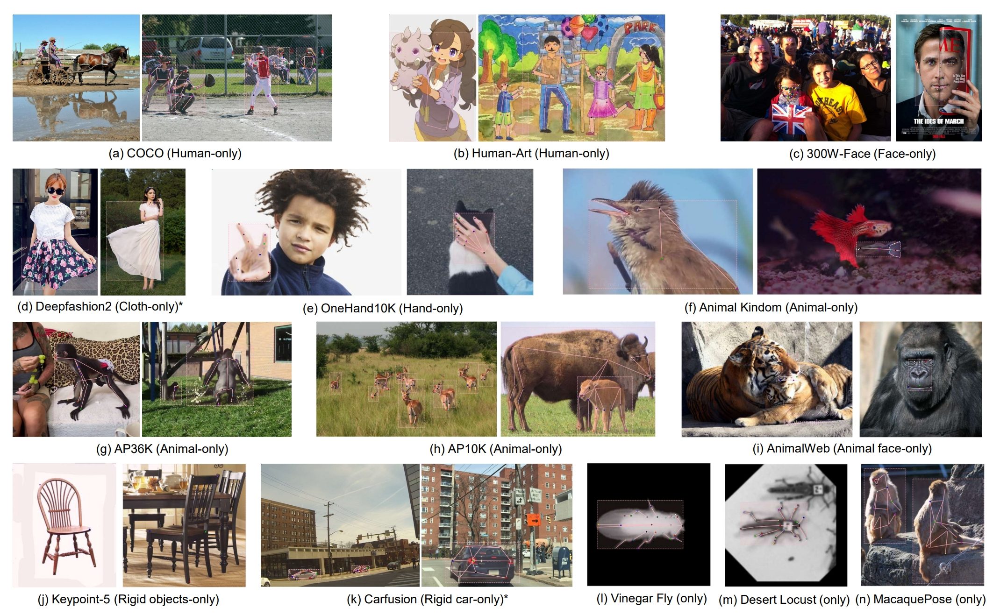

<div align="center">
<p align="center">  </p>
<h2> X-Pose: Detecting Any Keypoints  </h2> 


[](https://paperswithcode.com/sota/2d-human-pose-estimation-on-human-art?p=unipose-detecting-any-keypoints)
[](https://paperswithcode.com/sota/2d-pose-estimation-on-animal-kingdom?p=unipose-detecting-any-keypoints)
[](https://paperswithcode.com/sota/2d-pose-estimation-on-300w?p=unipose-detecting-any-keypoints)
[](https://paperswithcode.com/sota/2d-pose-estimation-on-macaquepose?p=unipose-detecting-any-keypoints)
[](https://paperswithcode.com/sota/2d-pose-estimation-on-desert-locust?p=unipose-detecting-any-keypoints)
[](https://paperswithcode.com/sota/2d-pose-estimation-on-vinegar-fly?p=unipose-detecting-any-keypoints)
[](https://paperswithcode.com/sota/multi-person-pose-estimation-on-coco?p=unipose-detecting-any-keypoints)
[](https://paperswithcode.com/sota/animal-pose-estimation-on-ap-10k?p=unipose-detecting-any-keypoints)

***Online demo***:[](https://openxlab.org.cn/apps/detail/IDEA-Research/IDEA)
***Quick Checkpoint download***:[](https://openxlab.org.cn/models/detail/IDEA-Research/UniPose)
#### [<code>Project Page</code>](https://yangjie-cv.github.io/X-Pose/) | [<code>Paper</code>](http://arxiv.org/abs/2310.08530)  | [<code>UniKPT Dataset</code>](https://drive.google.com/file/d/1ukLPbTpTfrCQvRY2jY52CgRi-xqvyIsP/view)  |[<code>Video</code>](https://github.com/IDEA-Research/UniPose)

[Jie Yang<sup>1,2</sup>](https://yangjie-cv.github.io/), [Ailing Zeng<sup>1</sup>](https://ailingzeng.site/), [Ruimao Zhang<sup>2</sup>](http://www.zhangruimao.site/), [Lei Zhang<sup>1</sup>](https://www.leizhang.org/)

<sup>1</sup>[International Digital Economy Academy](https://www.idea.edu.cn/research/cvr.html) <sup>2</sup>[The Chinese University of Hong Kong, Shenzhen](https://www.cuhk.edu.cn/en)
</div>

## 🤩 News
- **2024.07.12:** X-Pose supports controllable animal face animation. See details [here](https://github.com/ShiJiaying/LivePortrait).
               

- **2024.07.02:** X-Pose is accepted to ECCV24 (We changed the model name from UniPose to X-Pose to avoid confusion with similarly named previous works).
- **2024.02.14:** We update a [file](https://github.com/IDEA-Research/UniPose/blob/master/util/instance.txt) to highlight all classes (1237 classes) in the UNIKPT dataset.
- **2023.11.28:** We are excited to highlight the 68 face keypoints detection ability of X-Pose across any categories in this [figure](https://github.com/IDEA-Research/UniPose/blob/master/asset/anyface.png). The definition of face keypoints follows this [dataset](https://github.com/jin-s13/COCO-WholeBody/blob/master/imgs/Fig2_anno.png).
- **2023.11.9:** Thanks to [OpenXLab](https://openxlab.org.cn/models/detail/IDEA-Research/UniPose), you can try a quick [online demo](https://openxlab.org.cn/apps/detail/IDEA-Research/IDEA). Looking forward to the feedback!
- **2023.11.1:** We release the inference code, demo, checkpoints, and the annotation of the UniKPT dataset.
- **2023.10.13:** We release the [arxiv](http://arxiv.org/abs/2310.08530) version.


### In-the-wild Test via X-Pose
X-Pose has strong fine-grained localization and generalization abilities across image styles, categories, and poses.
<p align="middle">

<br>
</p>

#### Detecting any Face Keypoints:
<p align="middle">

<br>
</p>

## 🗒 TODO 

- [x] Release inference code and demo.
- [x] Release checkpoints.
- [x] Release [UniKPT annotations](https://drive.google.com/file/d/1ukLPbTpTfrCQvRY2jY52CgRi-xqvyIsP/view).
- [ ] Release training codes.

## 💡 Overview

 • X-Pose is the first end-to-end prompt-based keypoint detection framework.
 

<p align="middle">

<br>
</p>


• It supports multi-modality prompts, including textual and visual prompts to detect arbitrary keypoints (e.g., from articulated, rigid, and soft objects).


#### Visual Prompts as Inputs:
<p align="middle">

<br>
</p>


#### Textual Prompts as Inputs:
<p align="middle">

<br>
</p>


## 🔨 Environment Setup 
   1. Clone this repo
   ```sh
   git clone https://github.com/IDEA-Rensearch/X-Pose.git
   cd X-Pose
   ```

   2. Install the needed packages
   ```sh
   pip install -r requirements.txt
   ```

   3. Compiling CUDA operators
   ```sh
   cd models/UniPose/ops
   python setup.py build install
   # unit test (should see all checking is True)
   python test.py
   cd ../../..
   ```


## ▶ Demo
### 1. Guidelines
 • We have released the textual prompt-based branch for inference. As the visual prompt involves a substantial amount of user input, we are currently exploring more user-friendly platforms to support this functionality.

 • Since X-Pose has learned strong structural prior, it's best to use the predefined skeleton as the keypoint textual prompts, which are shown in [predefined_keypoints.py](https://github.com/IDEA-Research/UniPose/blob/master/predefined_keypoints.py).

 • If users don't provide a keypoint prompt, we'll try to match the appropriate skeleton based on the user's instance category. If unsuccessful, we'll default to using the animal's skeleton, which covers a wider range of categories and testing requirements.

### 2. Run
Replace `{GPU ID}`, `image_you_want_to_test.jpg`, and `"dir you want to save the output"` with appropriate values in the following command
```bash
CUDA_VISIBLE_DEVICES={GPU ID} python inference_on_a_image.py \
-c config/UniPose_SwinT.py \
-p weights/unipose_swint.pth \
-i image_you_want_to_test.jpg \
-o "dir you want to save the output" \
-t "instance categories" \ (e.g., "person", "face", "left hand", "horse", "car", "skirt", "table")
-k "keypoint_skeleton_text" (If necessary, please select an option from the 'predefined_keypoints.py' file.)
```


We also support the inference using gradio. 
```bash
python app.py
```

## Checkpoints
<!-- insert a table -->
<table>
  <thead>
    <tr style="text-align: center;">
      <th></th>
      <th>name</th>
      <th>backbone</th>
      <th>Keypoint AP on COCO</th>
      <th>Checkpoint</th>
      <th>Config</th>
    </tr>
  </thead>
  <tbody>
    <tr style="text-align: center;">
      <th>1</th>
      <td>X-Pose</td>
      <td>Swin-T</td>
      <td>74.4</td>
      <td><a href="https://drive.google.com/file/d/13gANvGWyWApMFTAtC3ntrMgx0fOocjIa/view"> Google Drive</a> /<a href="https://openxlab.org.cn/models/detail/IDEA-Research/UniPose"> OpenXLab</a>
      <td><a href="https://github.com/IDEA-Research/UniPose/blob/master/config_model/UniPose_SwinT.py">GitHub Link</a></td>
    </tr>
  </tbody>
  <tbody>
    <tr style="text-align: center;">
      <th>2</th>
      <td>X-Pose</td>
      <td>Swin-L</td>
      <td>76.8</td>
      <td> Coming Soon</td>
      <td> Coming Soon</td>
    </tr>
  </tbody>
</table>


## The UniKPT Dataset
<p align="middle">

<br>
</p>

| Datasets                                                                                                                                                 | KPT     | Class | Images | Instances            | Unify Images  | Unify Instance |  
|----------------------------------------------------------------------------------------------------------------------------------------------------------|---------|-------|--------|----------------------|---------------|----------------| 
| [COCO](https://arxiv.org/abs/1911.07451)                                                                                                                 | 17      | 1     | 58,945| 156,165              | 58,945        | 156,165        | 
| [300W-Face](https://ibug.doc.ic.ac.uk/resources/300-W/)                                                                                                  | 68      | 1     |  3,837| 4,437                | 3,837         | 4,437          | 
| [OneHand10K](https://www.yangangwang.com/papers/WANG-MCC-2018-10.html)                                                                                   | 21      | 1     |11,703| 11,289               | 2,000         | 2000           | 
| [Human-Art](https://github.com/IDEA-Research/HumanArt)                                                                                                   | 17      | 1     | 50,000| 123,131              | 50,000        | 123,131        |
| [AP-10K](https://github.com/AlexTheBad/AP-10K)                                                                                                           | 17      | 54    | 10,015| 13,028               | 10,015        | 13,028         | 
| [APT-36K](https://github.com/pandorgan/APT-36K)                                                                                                          | 17      | 30    | 36,000| 53,006               | 36,000        | 53,006         | 
| [MacaquePose](http://www.pri.kyoto-u.ac.jp/datasets/macaquepose/index.html)                                                                              | 17      | 1     | 13,083| 16,393               | 2,000         | 2,320          |
| [Animal Kingdom](https://openaccess.thecvf.com/content/CVPR2022/papers/Shi_End-to-End_Multi-Person_Pose_Estimation_With_Transformers_CVPR_2022_paper.pdf) | 23      | 850   | 33,099| 33,099               | 33,099        | 33,099         | 
| [AnimalWeb](https://fdmaproject.wordpress.com/author/fdmaproject/)                                                                                       | 9       | 332   | 22,451 | 21,921               | 22,451        | 21,921         | 
| [Vinegar Fly](https://github.com/jgraving/DeepPoseKit-Data)                                                                                              | 31      | 1     |1,500| 1,500                | 1,500         | 1,500          | 
| [Desert Locust](https://github.com/jgraving/DeepPoseKit-Data)                                                                                            | 34      | 1     |  700| 700                  | 700           | 700            | 
| [Keypoint-5](https://github.com/jiajunwu/3dinn)                                                                                                          | 55/31   | 5     | 8,649| 8,649                | 2,000         | 2,000          | 
| [MP-100](https://github.com/luminxu/Pose-for-Everything)                                                                                                 | 561/293 | 100   | 16,943 | 18,000 | 16,943 | 18,000         | 
| [UniKPT](https://drive.google.com/file/d/1ukLPbTpTfrCQvRY2jY52CgRi-xqvyIsP/view)                                                                       | 338     | 1237  | -      | -                    | 226,547       | 418,487        | 


 • UniKPT is a unified dataset from 13 existing datasets, which is only for non-commercial research purposes.

• All images included in the UniKPT dataset originate from the datasets listed in the table above. To access these images, please download them from the original repository.

• We provide the [annotations](https://drive.google.com/file/d/1ukLPbTpTfrCQvRY2jY52CgRi-xqvyIsP/view) with precise keypoints' textual descriptions for effective training. More conveniently, you can find the text annotations in the [link](https://github.com/IDEA-Research/UniPose/blob/master/predefined_keypoints.py).


### Citing X-Pose
If you find this repository useful for your work, please consider citing it as follows:

```
@article{xpose,
  title={X-Pose: Detection Any Keypoints},
  author={Yang, Jie and Zeng, Ailing and Zhang, Ruimao and Zhang, Lei},
  journal={ECCV},
  year={2024}
}
```
```
@inproceedings{yang2023neural,
  title={Neural Interactive Keypoint Detection},
  author={Yang, Jie and Zeng, Ailing and Li, Feng and Liu, Shilong and Zhang, Ruimao and Zhang, Lei},
  booktitle={Proceedings of the IEEE/CVF International Conference on Computer Vision},
  pages={15122--15132},
  year={2023}
}
```

```
@inproceedings{yang2022explicit,
  title={Explicit Box Detection Unifies End-to-End Multi-Person Pose Estimation},
  author={Yang, Jie and Zeng, Ailing and Liu, Shilong and Li, Feng and Zhang, Ruimao and Zhang, Lei},
  booktitle={The Eleventh International Conference on Learning Representations},
  year={2022}
}
```
